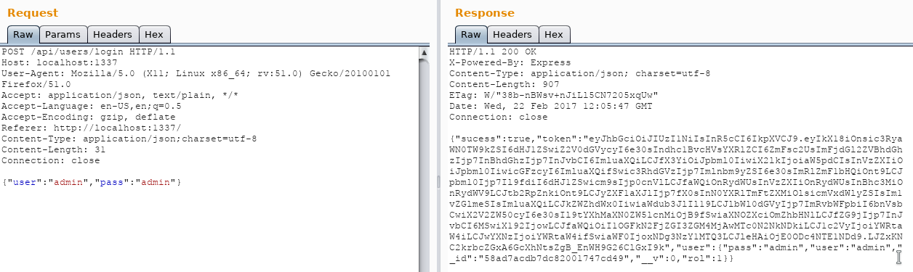
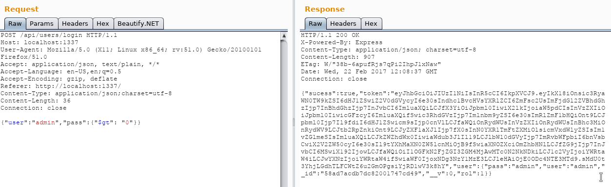

# Dusty-Node

<div style="text-align:center"></div>

## NoSQL Injection

### Introducción

Las bases de datos NoSQL es una tecnología que ha venido para quedarse, en una era donde la cantidad de datos no hace más que crecer nos vemos obligados a prescindir de ACID y usar bases de datos más ligeras.

Un buen ejemplo de esto es MongoDB, una base de datos documental que es ampliamente utilizada en la actualidad por multitud de aplicaciones. Si bien es cierto que estas bases de datos no usan SQL, los ataques de inyección siguen siendo posibles, surgiendo así los ataques de inyección NoSQL.

### Diferencias entre NoSQL injection y SQL injection

En primer lugar, la facilidad de realización es similar, sin embargo una vulnerabilidad de inyección NoSQL puede ser menos grave por los siguientes motivos:

* Si la BD está correctamente fragmentada, en una inyección NoSQL es complicado cambiar la colección sobre la que se realizan las queries, esto se debe a que habría que cambiar la dirección de la conexión del conector que muchas veces está harcodeada. Una vez que el se establece la conexión con una colección, las operaciones realizadas por el conector solo se pueden realizar en el contexto de la conexión. No podemos cambiar de tabla o de base de datos como en SQL.
* Normalmente no podemos cambiar el tipo de operación que se realiza, esto es, si la operación es un find entonces no la podremos cambiar a delete de manera sencilla.

### Definiendo el reto

Con el objetivo de aprender sobre un caso práctico pondremos a disposición de todo el mundo un docker con una aplicación vulnerable. El objetivo será conseguir las 3 banderas que se encuentran en su interior.

El código se encuentra [aquí](https://github.com/snooze6/dusty-node)

### Construir la imagen de docker y ejecutar el contenedor

```shell
  git clone https://github.com/snooze6/dusty-node
  # Con esto creamos la imágen
  make docker-build
  # Con esto iniciamos el contenedor
  make docker-run
```

Y la aplicación debería estar disponible en [http://localhost:1337](http://localhost:1337)

## NOSQL injection hello-world

A la vista del siguiente código:

```javascript
// Login handler
router.post('/login', function (req, res, next) {

    if (req.body && req.body.user && req.body.pass) {
        User.findOne({user: req.body.user, pass: req.body.pass}, function (err, user) {
            [...] // Cosas aquí
        });
    } else {
        res.json({sucess: false, error: 'No username or password sent'})
    }
});
```

Se puede apreciar que los parámetros user y password no tienen ningún tipo de validación de manera que el usuario puede introducir cualquier valor y este se coloca directamente en la consulta a través del conector de mongodb.

Para observar las conexionesse ha puesto burp suite como proxy de manera que podamos repetir las peticiones que se hacen en la página. Por curiosidad se le puede lanzar un active scanner al login y se observa que no detecta esta vulnerabilidad (22/02/2017). Una petición normal sería la siguiente:



Y una petición que explote la vulnerabilidad vista en el código sería esta:



La explicación es sencilla; al no controlar el input del usuario, este puede insertar un objeto entero y este objeto se introduce en la consulta a mongo y podemos así loguearnos desconociendo la contraseña del usuario.

```javascript
User.findOne({user: {"$gt": "0"}, pass: {"$gt": "0"}}, function (err, user) {
    [...] // Cosas aquí
});
```

Al comparar una string que no está vacía con 0 mongoDB nos da que es positivo y nos devolverá el usuario, que luego nos devolverá el token.

## Ejercicios

Una vez entendido el mecanismo del NoSQL injection, ya es posible conseguir las flags que están escondidas en el código. Como pistas puedo decir que:

* __Ejercicio 1:__ Es un producto que está escondido
* __Ejercicio 2:__ Es la contraseña de un usuario
* __Ejercicio 3:__ Está en un archivo del servidor

# Links de interés

1. [Hacking NodeJS and MongoDB](http://blog.websecurify.com/2014/08/hacking-nodejs-and-mongodb.html)
2. [NoSQL injection wordlist](https://github.com/cr0hn/nosqlinjection_wordlists/blob/master/mongodb_nosqli.txt)
3. [SSJS Web Shell Injection](https://s1gnalcha0s.github.io/node/2015/01/31/SSJS-webshell-injection.html)
4. [SSJS Injection](http://hydrasky.com/network-security/server-side-javascript-injection-ssjs/)
